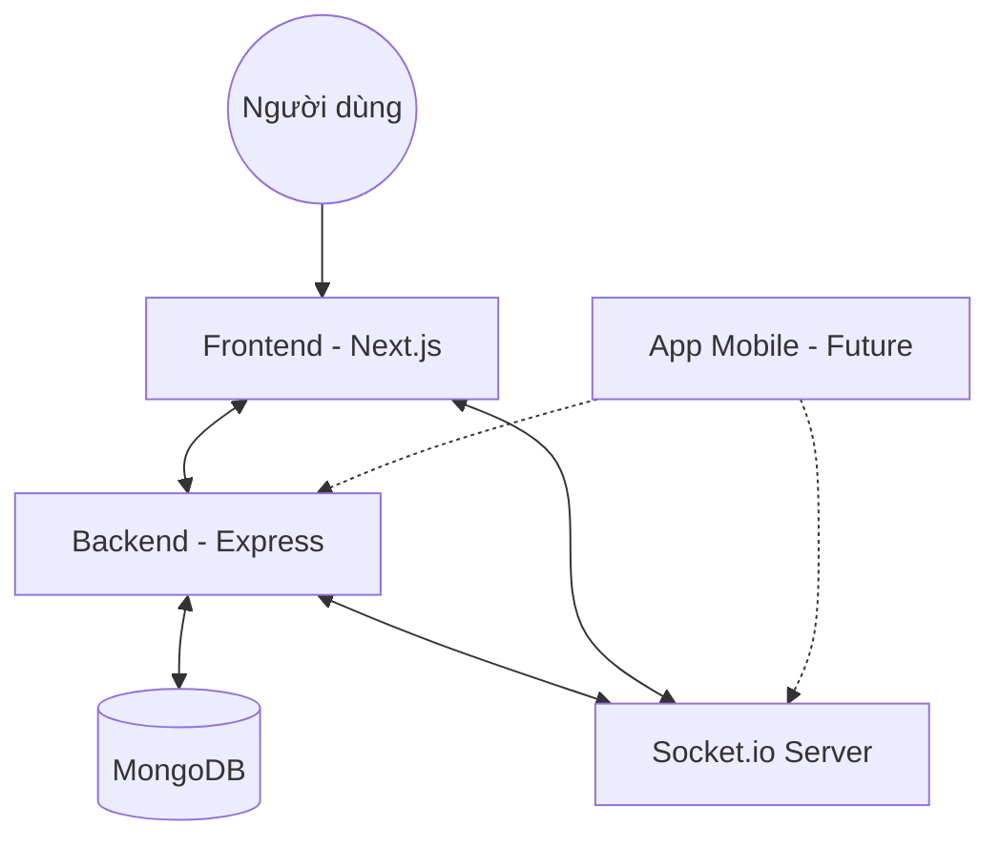

# Hudu Chat App 💬

Hudu Chat App là một nền tảng trò chuyện thời gian thực (real-time) hiện đại, được xây dựng với mục tiêu mang lại trải nghiệm giao tiếp mượt mà, bảo mật và đa nền tảng. Hiện tại, dự án đang tập trung phát triển phiên bản Web và định hướng mở rộng sang ứng dụng di động trong tương lai gần.

---

## 🌟 Tầm nhìn dự án

Hudu Chat không chỉ đơn thuần là một ứng dụng nhắn tin. Chúng tôi hướng tới việc xây dựng một hệ sinh thái giao tiếp thông minh, nơi mọi người có thể kết nối không khoảng cách với tốc độ cao nhất và giao diện người dùng tinh tế nhất.

## ✨ Tính năng chính (Dự kiến & Đang phát triển)

- **Trò chuyện thời gian thực:** Nhắn tin tức thời sử dụng công nghệ WebSockets.
- **Xác thực người dùng:** Đăng ký, đăng nhập và quản lý tài khoản bảo mật.
- **Quản lý hội thoại:** Tạo nhóm chat, trò chuyện cá nhân (1-1).
- **Chia sẻ đa phương tiện:** Gửi hình ảnh, file và emoji sinh động.
- **Thông báo đẩy:** Nhận thông báo ngay lập tức khi có tin nhắn mới.
- **Trạng thái hoạt động:** Hiển thị người dùng đang online/offline.
- **Tìm kiếm:** Tìm kiếm tin nhắn và người dùng nhanh chóng.

## 🛠 Công nghệ sử dụng

Dự án được tổ chức theo cấu trúc **Monorepo** để dễ dàng quản lý cả Frontend và Backend.

### 💻 Frontend (apps/web)

- **Framework:** [Next.js](https://nextjs.org/) (React 19)
- **Styling:** [Tailwind CSS](https://tailwindcss.com/)
- **UI Components:** [Ant Design](https://ant.design/)
- **State Management:** React Context API / Zustand

### ⚙️ Backend (apps/api)

- **Runtime:** [Node.js](https://nodejs.org/) (TypeScript)
- **Framework:** [Express 5](https://expressjs.com/)
- **Database:** [MongoDB](https://www.mongodb.com/) (Mongoose)
- **Real-time:** [Socket.io](https://socket.io/) (Kế hoạch tích hợp)

### 🚀 Future Expansion (Roadmap)

- **Mobile App:** Phát triển ứng dụng di động sử dụng **React Native** hoặc **Expo**, chia sẻ logic nghiệp vụ từ Monorepo hiện tại.

## 🏗 Kiến trúc hệ thống



## 💻 Hướng dẫn cài đặt

### Yêu cầu hệ thống

- Node.js 20+
- MongoDB (Local hoặc Atlas)

### Các bước cài đặt

1.  **Clone dự án:**

    ```bash
    git clone https://github.com/your-username/hudu-chat-app.git
    cd hudu-chat-app
    ```

2.  **Cài đặt dependencies cho toàn bộ workspace:**

    ```bash
    npm run install:all
    ```

3.  **Cấu hình biến môi trường:**
    - Tạo file `.env` trong thư mục `apps/api` (Dựa trên `.env.example`).
    - Cấu hình `MONGODB_URI` và `PORT`.

4.  **Chạy dự án ở chế độ phát triển:**
    ```bash
    npm run dev
    ```
    _Lệnh này sẽ chạy cả Web (Cổng 3000) và API (Cổng 5000) đồng thời._

---

## 🤝 Đóng góp

Mọi ý kiến đóng góp và báo lỗi vui lòng mở **Issue** hoặc tạo **Pull Request**. Chúng tôi luôn trân trọng sự đóng góp của bạn để Hudu Chat ngày càng hoàn thiện hơn!

---

_Phát triển bởi đội ngũ Hudu._
