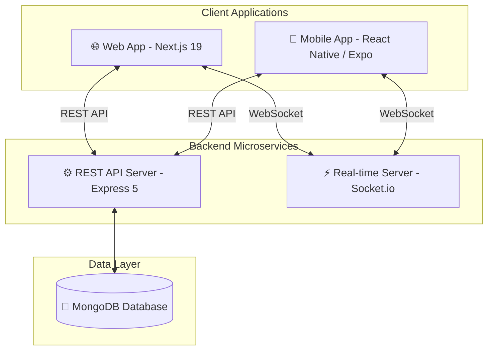

<p align="center">
  
</p>

<h1 align="center">💬 Halo Chat Platform</h1>

<p align="center">
  <b>Hệ thống Trò chuyện Thời gian thực Đa nền tảng Hiện đại, Tốc độ cao & Bảo mật</b>
</p>

<p align="center">
  <a href="https://nextjs.org/"></a>
  <a href="https://reactnative.dev/"></a>
  <a href="https://expressjs.com/"></a>
  <a href="https://www.mongodb.com/"></a>
  <a href="https://socket.io/"></a>
  <a href="https://typescriptlang.org/"></a>
</p>

---

## 🌟 Giới thiệu

**Halo Chat Platform** (trước đây là Hudu Chat) là giải pháp truyền thông nhắn tin thời gian thực thế hệ mới. Được thiết kế với kiến trúc **Monorepo** hiện đại, dự án mang tới trải nghiệm trò chuyện mượt mà, phản hồi tức thì với giao diện Messenger-style chuẩn 60fps, hỗ trợ đầy đủ cả Web và ứng dụng Di động (Mobile).

---

## ✨ Tính năng nổi bật

| Feature                      | Mô tả chi tiết                                                                           |
| :--------------------------- | :--------------------------------------------------------------------------------------- |
| ⚡ **Real-time Messaging**   | Gửi và nhận tin nhắn tức thì qua Socket.io với chỉ báo đã đọc / đang nhập tin nhắn.      |
| 📱 **Messenger-Style UI**    | Giao diện thanh nhạc/soạn thảo tin nhắn thu gọn mượt mà, animation đồng bộ bàn phím.     |
| 💬 **Rich Media & Reply**    | Hỗ trợ nhắn tin đa phương tiện (ảnh, video, file, voice) và swipe-to-reply chuẩn native. |
| 🔍 **Shared Element Search** | Hiệu ứng chuyển cảnh tìm kiếm Hero Animation 60fps mượt mà không nảy giật.               |
| 📖 **Story Feature**         | Đăng và xem Story phong cách Facebook Messenger tích hợp camera & thư viện ảnh.          |
| 📌 **Pinned Messages**       | Ghim tin nhắn quan trọng trên đỉnh hội thoại với badge thumbtack trực quan.              |
| 🔐 **Bảo mật & Xác thực**    | Mã hóa tài khoản, xác thực bảo mật và phân quyền linh hoạt.                              |

---

## 🛠 Công nghệ sử dụng (Tech Stack)

Dự án được cấu trúc dạng **Monorepo** quản lý toàn bộ hệ sinh thái:

### 💻 Frontend (Web App)

- **Framework:** Next.js 19 (React 19)
- **Styling:** Tailwind CSS, Ant Design (AntD)
- **Animation:** Framer Motion & CSS Micro-animations

### 📱 Mobile App (React Native)

- **Framework:** Expo / React Native
- **Animations:** React Native Reanimated 2/3 (GPU Accelerated)
- **Navigation:** React Navigation

### ⚙️ Backend (API Server)

- **Runtime:** Node.js & TypeScript
- **Framework:** Express 5
- **Database:** MongoDB & Mongoose ORM
- **Real-time Engine:** Socket.io

---

## 🏗 Kiến trúc hệ thống



---

## 📁 Cấu trúc Monorepo

```
hudu-chat-app/
├── apps/
│   ├── api/          # Express 5 Backend API Server & Socket.io
│   ├── web/          # Next.js 19 Web Frontend App
│   └── mobile/       # React Native / Expo Mobile Application
├── docs/             # Tài liệu & Media Assets (Hero Banner, Screenshots)
├── start.sh          # Script khởi chạy tự động
├── docker-compose.yml# Cấu hình Docker container
└── package.json      # Root Workspaces configuration
```

---

## 🚀 Hướng dẫn cài đặt & Khởi chạy

### Yêu cầu hệ thống

- **Node.js:** `>= 20.x`
- **npm:** `>= 10.x`
- **MongoDB:** Local instance hoặc MongoDB Atlas URI

### Các bước thực hiện

1. **Clone repository:**

   ```bash
   git clone https://github.com/kinghatrung/halo-chat-platform.git
   cd halo-chat-platform
   ```

2. **Cài đặt dependencies cho tất cả Workspaces:**

   ```bash
   npm run install:all
   ```

3. **Cấu hình biến môi trường:**
   Tạo file `.env` tại thư mục `apps/api/.env` (tham khảo `.env.example` nếu có):

   ```env
   PORT=5000
   MONGODB_URI=mongodb://localhost:27017/halo_chat
   JWT_SECRET=your_super_secret_key
   ```

4. **Khởi chạy ứng dụng (Chế độ phát triển):**
   ```bash
   npm run dev
   ```
   _Lệnh này sẽ tự động khởi chạy đồng thời Web App (cổng `3000`) và API Server (cổng `5000`)._

---

## 🤝 Đóng góp (Contributing)

Mọi ý kiến đóng góp, báo lỗi hoặc đề xuất tính năng mới luôn được hoan nghênh!

1. Fork dự án
2. Tạo nhánh tính năng (`git checkout -b feature/AmazingFeature`)
3. Commit thay đổi (`git commit -m 'Add some AmazingFeature'`)
4. Push lên nhánh (`git push origin feature/AmazingFeature`)
5. Mở một **Pull Request**

---

<p align="center">
  Crafted with ❤️ by <b>Halo Chat Team</b>
</p>
